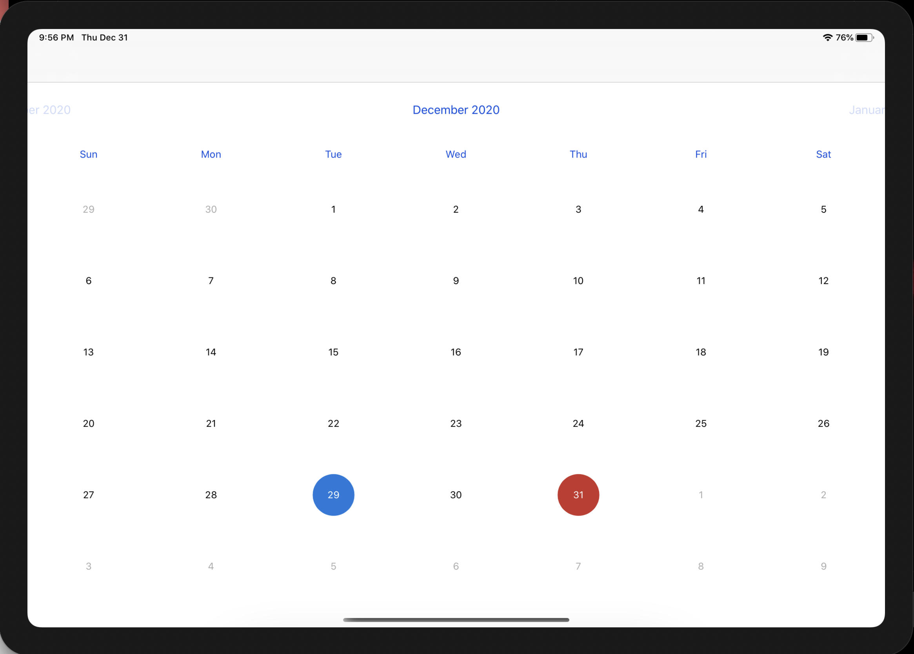

# Planner
Daily planner iOS application which implements FSCalendar and PencilKit

  
  
  

# Progress
- Basic functionalities completed (UI and unit tests in progress)
- Further functionalities work in progress

# Current functions
1) Home view: calendar
2) Click on a day in calendar leads to a canvas for that day where user can make notes/draw

